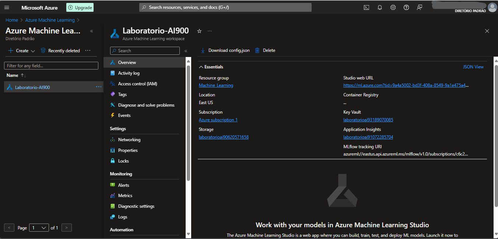

# Machine-Learning-na-Pratica-no-Azure-ML

 Participando do bootcamp da Dio e realizando um resumo do módulo

Iniciamos seguindo a documentação da Microsoft conforme link abaixo:

[Microsoft](https://microsoftlearning.github.io/mslearn-ai-fundamentals/Instructions/Labs/01-machine-learning.html).

## Explore o Aprendizado de Máquina Automatizado no Aprendizado de Máquina do Azure

Neste exercício, você usará o recurso de aprendizado de máquina automatizado no Aprendizado de Máquina do Azure para treinar e avaliar um modelo de aprendizado de máquina. Em seguida, você implantará e testará o modelo treinado.

Este exercício deve levar aproximadamente 30 minutos para ser concluído.

### Criar um espaço de trabalho do Aprendizado de Máquina do Azure

Para usar o Aprendizado de Máquina do Azure, você precisa provisionar um espaço de trabalho do Aprendizado de Máquina do Azure em sua assinatura do Azure. Em seguida, você poderá usar o estúdio do Aprendizado de Máquina do Azure para trabalhar com os recursos em seu espaço de trabalho.

1 - Entre no portal do Azure ao usar suas credenciais da Microsoft. https://portal.azure.com

2 - Selecione + Criar um recurso, procure Aprendizado de Máquina e crie um novo recurso de **Aprendizado de Máquina** do Azure com as seguintes configurações:

**Assinatura:** Sua assinatura do Azure.

**Grupo de recursos:** Crie ou selecione um grupo de recursos.

**Nome:** Insira um nome exclusivo para seu espaço de trabalho.

**Região:** Selecione a região geográfica mais próxima.

**Conta de armazenamento:** Observe a nova conta de armazenamento padrão que será criada para seu espaço de trabalho.

**Cofre de chaves:** Observe o novo cofre de chaves padrão que será criado para seu espaço de trabalho.

**Application insights:** Observe o novo recurso padrão de insights de aplicativo que será criado para seu espaço de trabalho.

**Registro de contêiner:** Nenhum (um será criado automaticamente na primeira vez que você implantar um modelo em um contêiner).

3 - Selecione **Revisar + criar** e, em seguida, selecione **Criar**. Aguarde até que seu espaço de trabalho seja criado (pode levar alguns minutos) e vá para o recurso implantado.

4 - Selecione **Iniciar estúdio** (ou abra uma nova guia do navegador e navegue até https://ml.azure.com e entre no estúdio do Aprendizado de Máquina do Azure usando sua conta da Microsoft). Feche todas as mensagens exibidas.

5 - No estúdio de Aprendizado de Máquina do Azure, você deve ver seu espaço de trabalho recém-criado. Caso contrário, selecione **Todos os espaços** de trabalho no menu à esquerda e, em seguida, selecione o espaço de trabalho que você acabou de criar.

