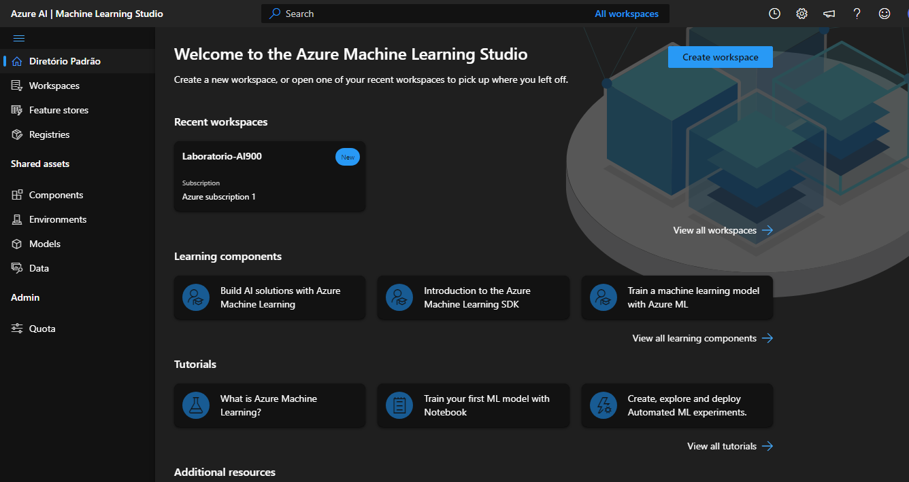
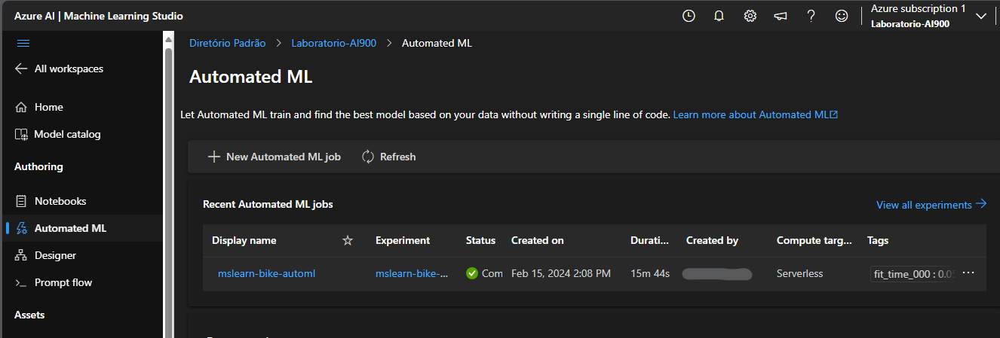
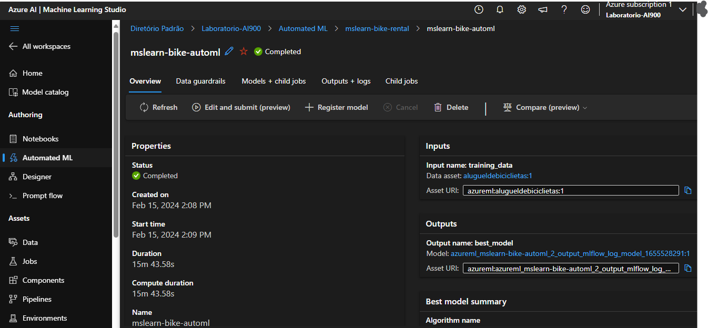
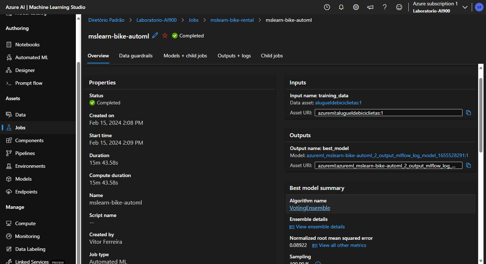
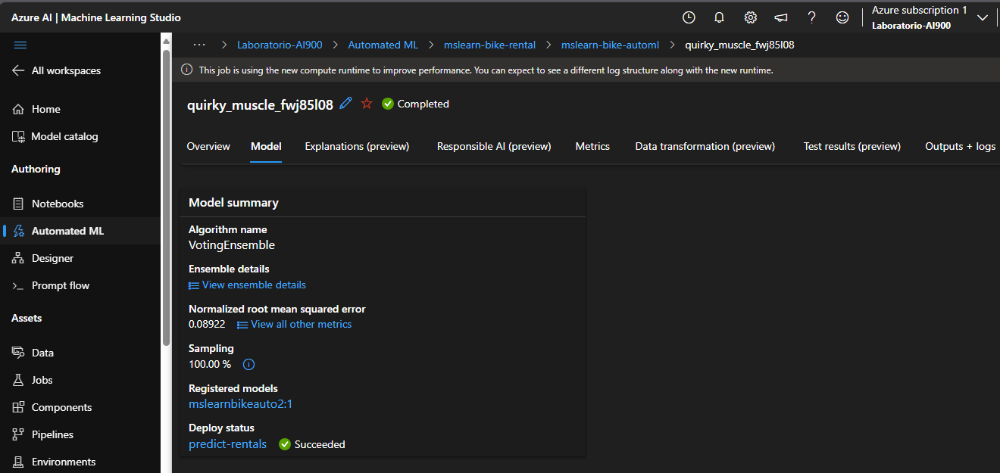
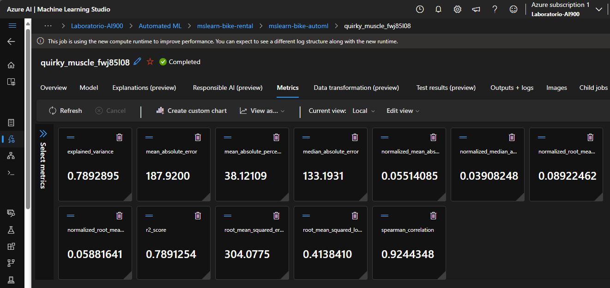
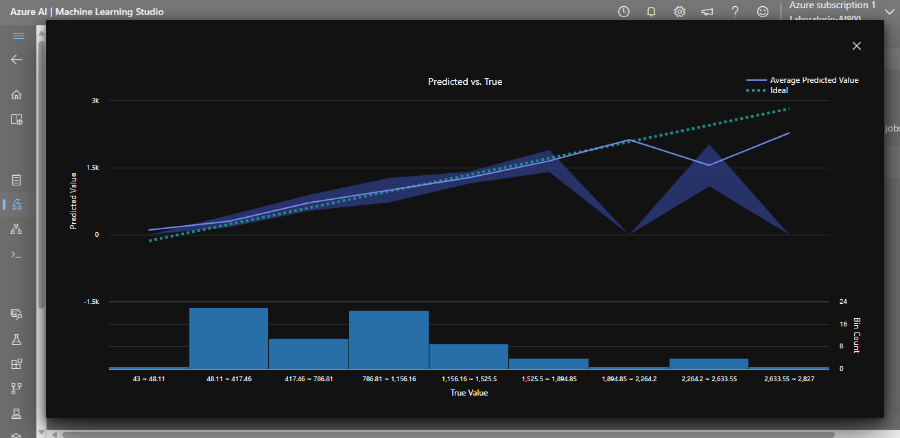
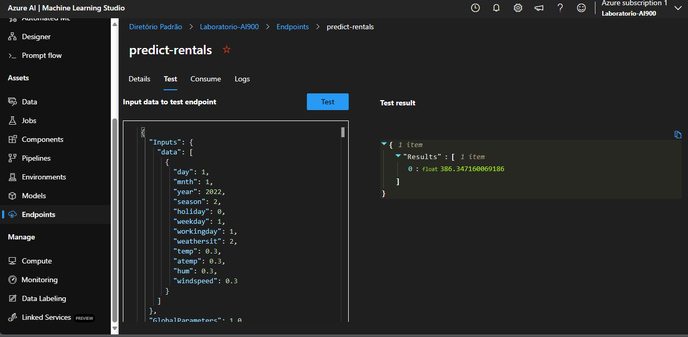

# Machine-Learning-na-Pratica-no-Azure-ML

 Participando do bootcamp da Dio e realizando um resumo do módulo

Iniciamos seguindo a documentação da Microsoft conforme link abaixo:

[Microsoft](https://microsoftlearning.github.io/mslearn-ai-fundamentals/Instructions/Labs/01-machine-learning.html)

## Explore o Aprendizado de Máquina Automatizado no Aprendizado de Máquina do Azure

Neste exercício, você usará o recurso de aprendizado de máquina automatizado no Aprendizado de Máquina do Azure para treinar e avaliar um modelo de aprendizado de máquina. Em seguida, você implantará e testará o modelo treinado.

Este exercício deve levar aproximadamente 30 minutos para ser concluído.

### Criar um espaço de trabalho do Aprendizado de Máquina do Azure

Para usar o Aprendizado de Máquina do Azure, você precisa provisionar um espaço de trabalho do Aprendizado de Máquina do Azure em sua assinatura do Azure. Em seguida, você poderá usar o estúdio do Aprendizado de Máquina do Azure para trabalhar com os recursos em seu espaço de trabalho.

1 - Entre no portal do Azure ao usar suas credenciais da Microsoft. https://portal.azure.com

2 - Selecione + Criar um recurso, procure Aprendizado de Máquina e crie um novo recurso de **Aprendizado de Máquina** do Azure com as seguintes configurações:

**Assinatura:** Sua assinatura do Azure.

**Grupo de recursos:** Crie ou selecione um grupo de recursos.

**Nome:** Insira um nome exclusivo para seu espaço de trabalho.

**Região:** Selecione a região geográfica mais próxima.

**Conta de armazenamento:** Observe a nova conta de armazenamento padrão que será criada para seu espaço de trabalho.

**Cofre de chaves:** Observe o novo cofre de chaves padrão que será criado para seu espaço de trabalho.

**Application insights:** Observe o novo recurso padrão de insights de aplicativo que será criado para seu espaço de trabalho.

**Registro de contêiner:** Nenhum (um será criado automaticamente na primeira vez que você implantar um modelo em um contêiner).

3 - Selecione **Revisar + criar** e, em seguida, selecione **Criar**. Aguarde até que seu espaço de trabalho seja criado (pode levar alguns minutos) e vá para o recurso implantado.

4 - Selecione **Iniciar estúdio** (ou abra uma nova guia do navegador e navegue até https://ml.azure.com e entre no estúdio do Aprendizado de Máquina do Azure usando sua conta da Microsoft). Feche todas as mensagens exibidas.

5 - No estúdio de Aprendizado de Máquina do Azure, você deve ver seu espaço de trabalho recém-criado. Caso contrário, selecione **Todos os espaços** de trabalho no menu à esquerda e, em seguida, selecione o espaço de trabalho que você acabou de criar.

### Usar o aprendizado de máquina automatizado para treinar um modelo

O aprendizado de máquina automatizado permite que você experimente vários algoritmos e parâmetros para treinar vários modelos e identificar o melhor para seus dados. Neste exercício, você usará um conjunto de dados de detalhes históricos de aluguel de bicicletas para treinar um modelo que prevê o número de aluguéis de bicicletas que devem ser esperados em um determinado dia, com base em características sazonais e meteorológicas.

**Citação:** Os dados utilizados neste exercício são derivados do Capital Bikeshare e são usados de acordo com o contrato de licença de dados publicado.

1 - No estúdio de Aprendizado de Máquina do Azure, exiba a página ML automatizada (em Criação).

2 - Crie um novo trabalho de ML automatizado com as seguintes configurações, usando **Avançar** conforme necessário para progredir pela interface do usuário:

#### *  **Configurações básicas:**

**Nome do trabalho:** mslearn-bike-automl

**Novo nome do experimento:** mslearn-bike-rental

**Descrição:** Aprendizado de máquina automatizado 
para previsão de aluguel de bicicletas

**Tags:** nenhuma

### **Tipo de tarefa & data:**

**Selecionar tipo de tarefa:** Regressão

**Selecionar conjunto de dados:** crie um novo conjunto de dados com as seguintes configurações:

##### **Tipo de dados:**

**Nome:** bike-rentals

**Descrição:** Dados históricos de aluguer de bicicletas

**Tipo:** Tabular

#### **Fonte de dados:**

Selecionar de **arquivos da Web**

#### **URL da Web:**

**URL da Web:** https://aka.ms/bike-rentals

**Ignorar validação de dados:** não selecione

#### **Configurações:**

**Formato de arquivo:** Delimitado

**Delimitador:** Vírgula

**Codificação:** UTF-8

**Cabeçalhos de coluna:** Somente o primeiro arquivo tem cabeçalhos

**Pular linhas:** Nenhum

**O conjunto de dados contém dados de várias linhas:** não selecione

#### **Esquema:**

Incluir todas as colunas diferentes de **Caminho**

Revisar os tipos detectados automaticamente

Selecione **Criar.** Depois que o conjunto de dados for criado, selecione o conjunto de dados de **aluguel de bicicletas** para continuar a enviar o trabalho de ML automatizado.

### **Configurações da tarefa:**

**Tipo de tarefa:** Regressão

**Conjunto de dados:** aluguel de bicicletas

**Coluna de destino:** Aluguéis (inteiro)

**Definições de configuração adicionais:**

**Métrica primária:** Erro quadrático médio da raiz normalizada

**Explicar melhor modelo:** Não selecionado

**Use todos os modelos suportados:** Nãoselecionado. Você restringirá o trabalho para tentar apenas alguns algoritmos específicos.

**Modelos permitidos:** selecione apenas **RandomForest e LightGBM** — normalmente você gostaria de tentar o maior número possível, mas cada modelo adicionado aumenta o tempo necessário para executar o trabalho.

**Limites:** expanda esta seção

**Máximo de tentativas:** 3

**Máximo de tentativas simultâneas:** 3

**Nós máximos:** 3

**Limiar de pontuação métrica:** 0,085 (de modo que, se um modelo atingir uma pontuação métrica quadrática média normalizada de 0,085 ou menos, o trabalho termina.)

**Tempo limite:** 15

**Tempo limite de iteração:** 15

**Habilitar rescisão antecipada:** Selecionado

#### **Validação e teste:**

**Tipo de validação:** Divisão de validação de trem

**Porcentagem de dados de validação:** 10

**Conjunto de dados de teste:** Nenhum
Computação:

**Selecione o tipo de computação:** Serverless

**Tipo de máquina virtual:** CPU

**Camada de máquina virtual:** Dedicado

**Tamanho da máquina virtual:** Standard_DS3_V2*

**Número de instâncias:** 1

* Se sua assinatura restringir os tamanhos de VM disponíveis para você, escolha qualquer tamanho disponível.

Envie o trabalho de treinamento. Ele começa automaticamente.

Aguarde a conclusão do trabalho. Pode demorar um pouco – agora pode ser um bom momento para uma pausa para o café!

### Reveja o melhor modelo

Quando o trabalho de aprendizado de máquina automatizado for concluído, você poderá revisar o melhor modelo treinado.

1 - Na guia **Visão geral** do trabalho de aprendizado de máquina automatizado, observe o melhor resumo do modelo.

2 - Selecione o texto em **Nome do algoritmo** para o melhor modelo para exibir seus detalhes.

3 - Selecione a guia **Métricas** e selecione os **gráficos de resíduos** e **predicted_true** se ainda não estiverem selecionados.

Analise os gráficos que mostram o desempenho do modelo. O gráfico de resíduos mostra os resíduos (as diferenças entre os valores previstos e reais) como um histograma. O gráfico **predicted_true** compara os valores previstos com os valores verdadeiros.

### Implantar e testar o modelo

1 - Na guia **Modelo** para obter o melhor modelo treinado pelo seu trabalho de aprendizado de máquina automatizado, selecione **Implantar** e usar a opção **Serviço Web** para implantar o modelo com as seguintes configurações:

**Nome:** predict-rentals

**Descrição:** Prever aluguéis de ciclos

**Tipo de computação:** Instância de Contêiner do Azure

**Habilitar autenticação:** Selecionado

2 - Aguarde o início da implantação - isso pode levar alguns segundos. O **status de implantação** para o ponto de extremidade de **aluguel de previsão** será indicado na parte principal da página como Em execução.

3 - Aguarde até que o status Implantar seja alterado para Bem-sucedido. Isso pode levar de 5 a 10 minutos.

    ### Testar o serviço implantado

Agora você pode testar seu serviço implantado.

1 - No estúdio do Aprendizado de Máquina do Azure, no menu à esquerda, selecione Pontos de extremidade e abra o **ponto de extremidade** em tempo real de **aluguéis de previsão.**

2 - Na página de ponto de extremidade em tempo real de **aluguéis de previsão**, exiba a guia Teste.

3 - No painel Dados de entrada **para testar o ponto de extremidade**, substitua o modelo JSON pelos seguintes dados de entrada:

4 - Clique no botão **Testar**.

5 - Analise os resultados do teste, que incluem um número previsto de aluguéis com base nos recursos de entrada - semelhante a imagem acima em **"Results"**.

O painel de teste pegou os dados de entrada e usou o modelo treinado para retornar o número previsto de aluguéis.

Vamos rever o que você fez. Você usou um conjunto de dados de dados históricos de aluguel de bicicletas para treinar um modelo. O modelo prevê o número de aluguéis de bicicletas esperados em um determinado dia, com base em características sazonais e meteorológicas.

Esse foi mais um laboratório em minha luta diária para alcançar o meu melhor

Gilson Ravaiani